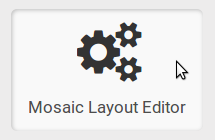
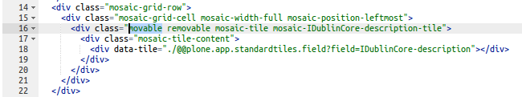
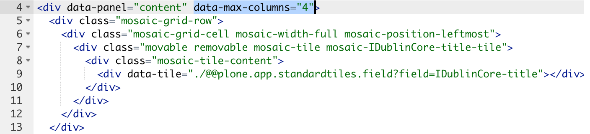

Content Layouts
===============

There is a Plone control panel to configure Mosaic called *Mosaic Layout Editor*.

Just add **@@layouts-editor** to your sites URL.

Restricting content layouts globally
------------------------------------

To hide layouts globally...

Programmatically (while developing your product)
~~~~~~~~~~~~~~~~~~~~~~~~~~~~~~~~~~~~~~~~~~~~~~~~

Add it to the *hidden_content_layouts* list in the registry
 by configuring this in registry.xml:

.. code-block:: xml

   <record name="plone.app.mosaic.hidden_content_layouts">
     <value purge="False">
       <element>default/news_item.html</element>
     </value>
   </record>

Through-the-web
~~~~~~~~~~~~~~~

Go to the Mosaic settings in the sites control panel (see above) and choose the tab *Show/Hide Content Layouts*.

.. figure:: _screenshots/layouts-editor_show-hide-content-layouts.png

There you can toggle the visibility of your content layouts.

Restricting content layouts per content type
--------------------------------------------

You can restrict the choice of content layouts for each of the available
content types by adding a *manifest.cfg* to *your/product/layouts/*.

The following example was taken from *src/plone/app/mosaic/layouts/content/*
::

   [contentlayout]
   title = Basic
   description = Default content layout
   file = basic.html
   preview = basic.png

   [contentlayout]
   title = Document
   file = document.html
   for = Document
   preview = document.png

   [contentlayout]
   title = News item layout
   description = Default news item layout
   file = news_item.html
   for = News Item
   preview = news_item.png

There are three content layouts defined here.

**title**, **description**, **preview**
  The **title** and (optionally) **description** strings
  together with a prepared "thumbnail" **preview** of the respective layout
  will be shown to users when selecting one of the content layouts
  for some content item.

**for**
  The **for** setting limits for which Plone content types the content layouts
  may be selected. This may be a comma-separated list of content types.

**file**
  The **file** setting determines which html file is chosen.

So for each content layout you should provide

* a html file containing the actual layout
* a png file with a small preview
* a stanza in manifest.cfg

You can also hide a layout for one type in registry.xml

.. code-block:: xml

  <record name="plone.app.mosaic.hidden_content_layouts">
    <value purge="False">
      <element>default/news_item.html::News Item</element>
      </value>
  </record>

This will hide layout `default/news_item` for News Item.

Restricting, who can create new content layouts
-----------------------------------------------

see issue 253

plone.resourceeditor.ManageSources protects layout editor in control panel

Restricting, who can *change* content layouts
---------------------------------------------
Any user who can edit, can change layout on content they have access to edit.
"change" botton hidden

plone.ManageContentLayouts will protect changing site layouts once they are enabled

see above, ask nathan

Restricting who can customize/save new layouts through UI
----------------------------------------------------------

"Plone: Customize Content Layouts"(plone.CustomizeContentLayouts) permission
controls if user can customize and save the customized layout

  - by default this is Manager, Site Administrator, Owner, Editor
  - need to further customize this or workflow to be more restrictive

Who can edit global site layouts
--------------------------------

"Plone: Manage Content Layouts"(plone.ManageContentLayouts)

- by default this is Manager, Site Administrator

Moving and Editing tiles
========================

Example tile with all functionality to move, remove, edit, etc::
----------------------------------------------------------------

.. code-block:: xml

      

        

          

        

      

Adding unmovable tiles into content layouts
-------------------------------------------

If you want to have tiles in your layout that editors cannot move around
to other places in the current content layout through the Mosaic Editor,
you can remove *movable* from the classes definition in the Content Layouts Editor.

Example tile definition in layout

.. code-block:: xml

    

      

        

      

    

Adding non-removable tiles into content layouts (removing class 'removable' from 'mosaic-tile')
-----------------------------------------------------------------------------------------------

.. code-block:: xml

    

      

        

      

    

Adding readonly tiles into content layouts
------------------------------------------

Add class 'mosaic-read-only-tile' into 'mosaic-tile'

.. code-block:: xml

    

      

        

      

    

Configuring the amount of columns available in layout
-----------------------------------------------------

The default value for the amount of columns is set to 4. It can optionally
configured to a different value using the attribute *data-max-columns* in the
layout file. This attribute needs to be set on the *div* element that has the
attribute *data-panel="content"*

Adding editable HTML area (raw html tile) into content layout
-------------------------------------------------------------

*plone_app_standardtiles_html* (in registry.xml) is hidden - change to structure
to save html of tile at content and not in layout

Editor
======

see plone.app.mosaic registry.xml.
this can go into your policy product.
tinyMCE features need to be added/activated for each tile

*    Hiding a tile from insert menu
*    Moving a tile in insert menu
*    Adding a new HTML template tile into insert menu
*    Adding a new custom (Python based) tile into insert menu
*    Adding a new action into TinyMCE editor #200
*    Hiding tile formats from format menu
*    Adding a new tile format into format menu
*    Hiding row formats from format menu
*    Adding a new row format into format menu

Adding a new custom (Python based) tile into insert menu
----------------------------------------------------------

To add a python based tile to insert menu you have to add an entry for it to plone registry, e.g.:

.. code-block:: xml

    <records prefix="plone.app.mosaic.app_tiles.plone_app_standardtiles_tableofcontents"
             interface="plone.app.mosaic.interfaces.ITile">
      <value key="name">plone.app.standardtiles.tableofcontents</value>
      <value key="label">Table of contents</value>
      <value key="category">structure</value>
      <value key="tile_type">app</value>
      <value key="default_value"></value>
      <value key="read_only">false</value>
      <value key="settings">true</value>
      <value key="favorite">false</value>
      <value key="rich_text">false</value>
      <value key="weight">100</value>
    </records>

prefix: 
  "plone.app.mosaic.app_tiles" for app tiles chose rest
name:
  Name of your tile configured in zcml
label:
  This is displayed in insert menu
category:
  category on insert menu (e.g. structrue, field), a new category has to be registered, "hidden" to hide it
tile_type:
   text, field, app
default_value:
   for tile_type text only
read_only:
   if set to true tile is not clickable and has no little i / edit button (?) - while adding you can
settings:
  if set to false tile has no little i / edit button (?) - no settings form while adding
favorite:
  not used
rich_text:
   for text tile type
weight:
  order in insert menu

Hiding tile formats from format menu
------------------------------------

Remove values from "plone.app.mosaic.default_available_actions" configuration
registry entry

Adding a new tile format into format menu
-----------------------------------------

.. code-block:: xml

    <record name="plone.app.mosaic.default_available_actions">
      <value>
        <element>tile-my-format</element>
        <element>grid-row-my-format</element>
      </value>
    </record>

    <records interface="plone.app.mosaic.interfaces.IFormat"
             prefix="plone.app.mosaic.formats.tile_my_format">
      <value key="name">tile-my-format</value>
      <value key="category">tile</value>
      <value key="label">My format</value>
      <value key="action">tile-toggle-class</value>
      <value key="icon">true</value>
      <value key="favorite">false</value>
      <value key="weight">101</value>
    </records>

    <records interface="plone.app.mosaic.interfaces.IFormat"
             prefix="plone.app.mosaic.formats.grid_row_my_format">
      <value key="name">grid-row-my-format</value>
      <value key="category">row</value>
      <value key="label">My Format</value>
      <value key="action">row-toggle-class</value>
      <value key="icon">true</value>
      <value key="favorite">false</value>
      <value key="weight">100</value>
    </records>

Hiding row formats from format menu
---------------------------------------

Remove values from "plone.app.mosaic.default_available_actions" configuration registry entry

Adding a new row format into format menu
----------------------------------------

See above example, it does both
