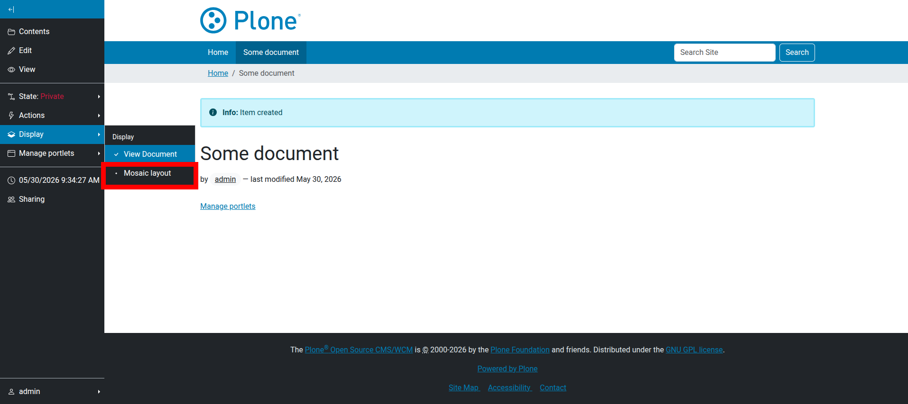
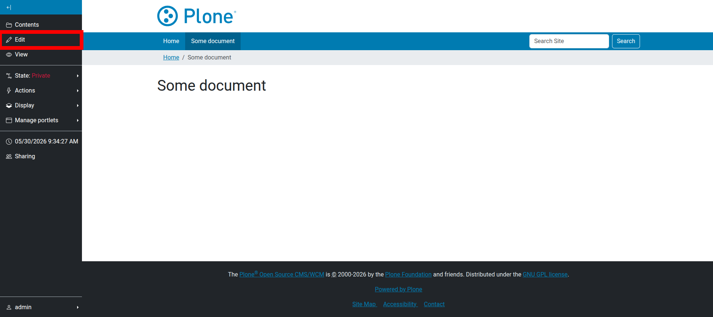
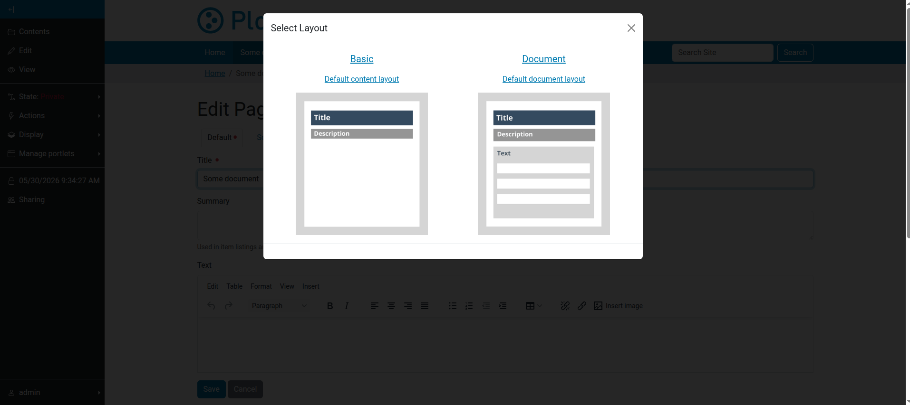
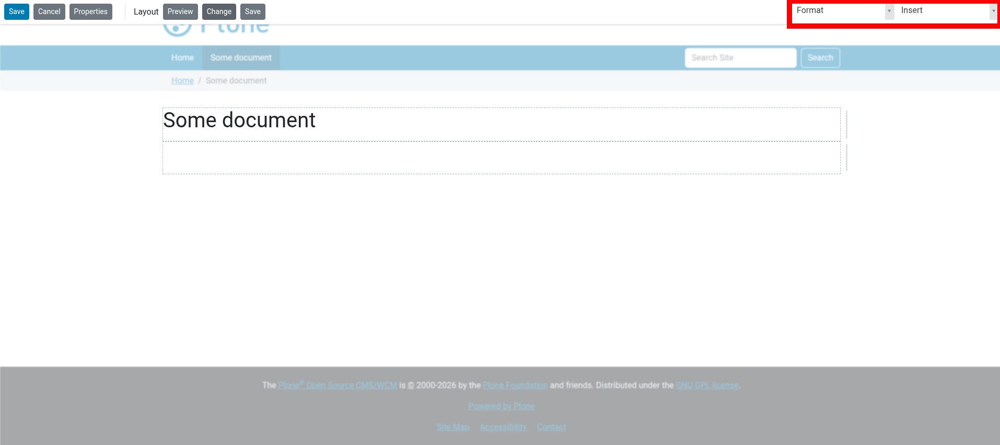
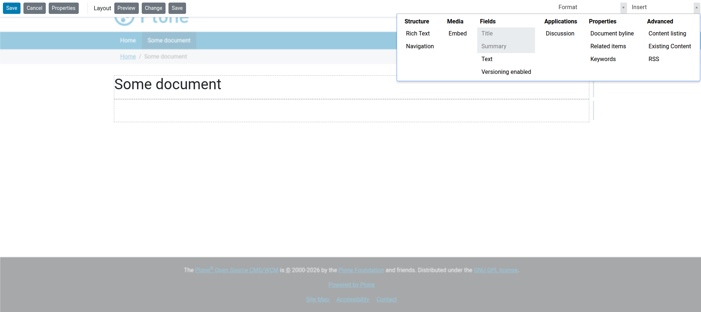

.. _section_getting_started:

Getting started
===============

First steps with Mosaic
-----------------------

This documentation will present you details how to work with **Plone Mosaic**
through the web and within a package.
If you haven't done it yet,
please read the `README.rst`_ to learn about the concepts in **Plone Mosaic**,
the requirements for the installation,
the projects status and how the development process of the product works.

.. _README.rst: https://github.com/plone/plone.app.mosaic/blob/master/README.rst

Mosaic Layout
-------------

In this section we will look at the **Layout-behavior** of **Plone Mosaic**.
It needs to be enabled in the display menu of a content item.
To follow along create a document and after saving it,
set the **Display** option to **Mosaic layout**.

   Selecting "Mosaic layout" from the Display menu.

How the current content looks after the first time the **Mosaic layout** is enabled
depends on the configured defaults for its portal type.
Still,
at least the title and the description should always be displayed.

Mosaic editor
-------------

When the **Mosaic layout** has been enabled,
the **Mosaic editor** is opened by clicking the **Edit** tab in the Plone toolbar.

   Clicking the Edit tab to open the Mosaic editor.

When the editor is opened for the first time,
it asks to the select the initial layout for the content.

   Selecting an initial layout for the content.

The selected layout can then be used as it is,
or it can be customized by adding, removing and formatting tiles.

Now the toolbar of the **Mosaic Editor** will appear on top of the content area.
The buttons **Save** and **Cancel** belong to the current *Edit* action of the content.
With them you can either save or discard the changes that were made to the current page.

The button **Properties** opens a form where you can edit several properties of the content element,
like the publishing date or the short name, without leaving the editor.

The dropdown **Layout** has the two options **Change** and **Customize**.
**Change** opens the form where you can choose another layout from all available predefined layouts.

With the option **Customize** you enable the current layout for customization,
i.e. two new dropdowns **Insert** and **Format** appear and allow to add new tiles and format existing ones.

   The Mosaic toolbar after clicking "Customize".

To add a new tile in the **Mosaic editor**, select a tile from the **Insert** menu.
Tiles are grouped into categories like **Structure**, **Media**, **Fields**, etc.

   The Insert menu with available tiles.

When you select a tile, it will appear as a draggable element. Drag it into the desired position in the content area.
As you move the tile, potential drop zones will be highlighted.

Finally, a mouse click drops the tile into the selected position and the page can be saved using the **Save** button in the Mosaic toolbar.

That's how we can build custom content layouts using Plone Mosaic.

Note that this custom layout is saved for the current content item.
The **Layout** dropdown now has the button **Save** instead of **Customize**.
With this you could save the layout globally and make it available for other content elements of the same type.
