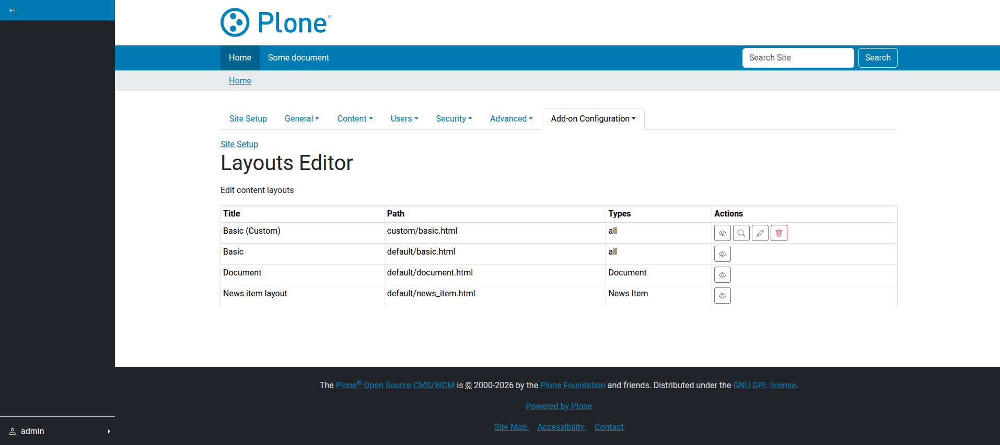

.. _how_to_manage_content_layouts:

How to Manage Content Layouts
=============================

This guide covers the various ways to manage and register content layouts in **Plone Mosaic**.

Managing Layouts Through the Web
--------------------------------

Mosaic provides a dedicated interface for managing layouts globally.

1.  Navigate to ``@@layouts-editor`` in your Plone site (e.g., ``http://localhost:8080/Plone/@@layouts-editor``).
2.  Use the interface to edit HTML, manifest settings, or toggle visibility of existing layouts.

   The Layout Editor interface.

Hiding Layouts from the Selection Menu
--------------------------------------

If you want to prevent users from selecting specific layouts, you can hide them.

Using the UI
~~~~~~~~~~~~

In the **Mosaic Layout Editor** (``@@layouts-editor``), select the **Show/Hide Content Layouts** tab and toggle the desired layouts.

Using the Registry
~~~~~~~~~~~~~~~~~~

Add the layout key to your package's ``registry.xml``:

.. code-block:: xml

   <record name="plone.app.mosaic.hidden_content_layouts">
     <value purge="False">
       <element>default/news_item.html</element>
     </value>
   </record>

Registering Layouts in a Package
--------------------------------

To include predefined layouts in your add-on:

1.  Create a directory for your layouts (e.g., ``src/my/package/layouts/``).
2.  Add an HTML file for the layout structure.
3.  Add a ``manifest.cfg`` file to define the metadata.

For detailed information on the manifest syntax and tile classes, see the :ref:`layouts_reference`.

Example ``manifest.cfg`` snippet:

.. code-block:: ini

   [contentlayout]
   title = Custom Page
   file = custom_page.html
   for = Document
