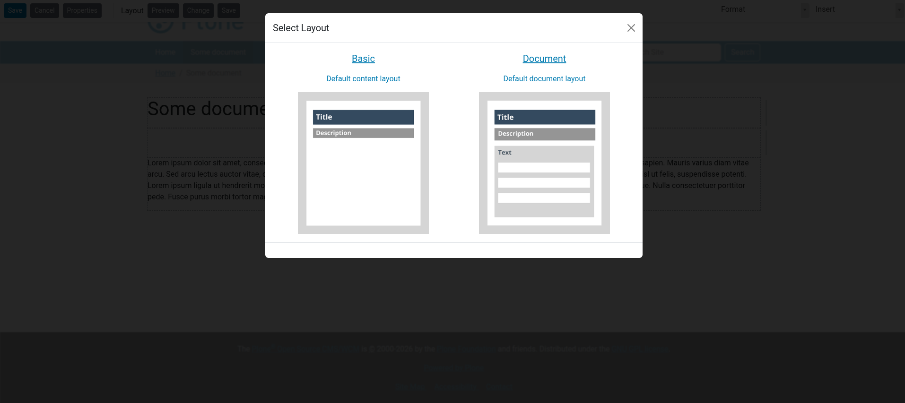

.. _section_site_layouts:

Site Layout Management
======================

Site layouts are the high-level templates that define the overall structure of the site, including common elements like the header, footer, and sidebars. They act as a wrapper for Content Layouts.

Enable Mosaic Site Layouts
--------------------------

To enable site layout functionality in Mosaic for Plone 6, you must ensure that the ``ILayoutAware`` behavior is enabled for your content types.

Changing the Current Site Layout
--------------------------------

For content types that are "Layout Aware", you can change the site layout through the **Layout** tab or menu.

   Selecting a site layout for a specific content item or section.

Site layouts can be applied at two levels:

1.  **Page Site Layout**: Applies only to the current content item.
2.  **Section Site Layout**: Applies to the current item and all its children (unless overridden).

Creating Site Layouts
---------------------

Site layouts are typically registered as resources in a theme or a policy package.

A typical site layout is an HTML file using the ``blocks`` syntax to define **panels**.

Example ``site.html``:

.. code-block:: html

   <!DOCTYPE html>
   <html>
     <body>
       <header id="header">
         

       </header>
       <main id="main">
         

       </main>
       <footer id="footer">
         

       </footer>
     </body>
   </html>

The ``data-panel="content"`` is where the content from the **Content Layout** will be injected.

Registering Site Layouts
------------------------

In your package's ``manifest.cfg`` (for layouts), you can register site layouts:

.. code-block:: ini

   [sitelayout]
   title = Full Width
   description = A layout without sidebars
   file = full-width.html
