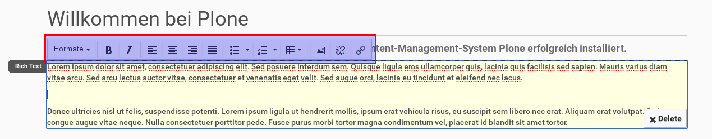

How to customize tinyMCE buttons on Rich Text tile
===================================================

You can change the buttons that are shown on Rich Text tile.

Just add something like that to your registry.xml

.. code-block:: xml

  <record name="plone.app.mosaic.app_tiles.plone_app_standardtiles_html.available_actions">
    <field type="plone.registry.field.List">
      <title>Available actions for my html tile</title>
      <value_type type="plone.registry.field.TextLine" />
    </field>
    <value>
      <element>toolbar-bold</element>
      <element>toolbar-italic</element>
      <element>toolbar-bullist</element>
      <element>toolbar-numlist</element>
    </value>
  </record>

If you reinstall plone.app.mosaic the default buttons are shown again, so you have to reinstall your product too. You can find more names of tinyMCE buttons in plone.app.mosaics registry.xml.
